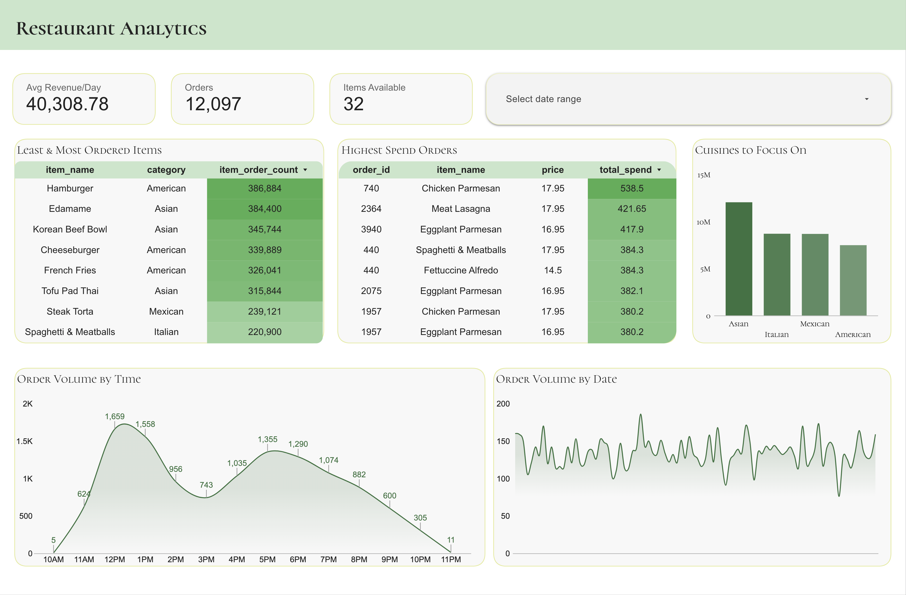
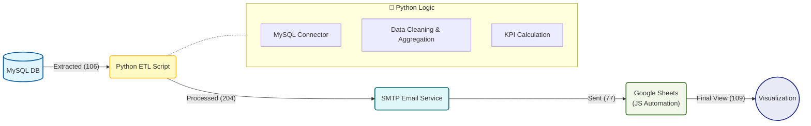

# Restaurant Analytics – SQL to BI ETL

<p align="center">
  
</p>

<p align="center">
  <i>End-to-end analytics dashboard built from SQL data using Python ETL and Looker Studio</i>
</p>

---

##  Architecture Workflow

This diagram represents the flow of data from the source database to the final user visualization.



Looker-Studio: 

```
https://lookerstudio.google.com/reporting/256749c2-2924-493d-a924-ab75e8233c9a
```
## Problem Statement

Restaurants generate large volumes of transactional data every day, but this data often stays locked inside databases and is difficult to use for business decisions.

The business needed:
- Visibility into **most and least ordered items**
- Understanding of **high-value orders**
- Insights into **peak and low ordering hours**
- Data-driven decisions on **which cuisines to expand**
- An **automated reporting process**

This project solves these problems using a **simple end-to-end ETL pipeline**.

---

## Project Overview

This is a **demo ETL project** that moves data directly from **SQL to visualization**.


---

## Tech Stack

- **Database:** MySQL  
- **ETL:** Python (pandas)  
- **Automation:** Gmail + Google Apps Script  
- **Visualization:** Looker Studio  

---

## Data Source

- `order_details`
- `menu_items`

These tables are joined to create a single analytics-ready dataset.

---

## ETL Process

**Extract**
- Pulls data from MySQL using SQL queries

**Transform**
- Cleans data types
- Adds time features (order hour)
- Calculates order, item, and category metrics

**Load**
- Creates one final CSV
- Sends the report automatically via email
- Feeds Google Sheets and Looker Studio

---

## Business Questions Answered

- Which items are **most and least ordered**
- Which orders generate the **highest spend**
- When do **peak and slow hours** occur
- Which **cuisines perform best** and should be expanded

---

## Output

- **Final File:** `restaurant_analytics_final.csv`
- **Used for:**
  - Google Sheets (view layer)
  - Looker Studio dashboard
  - Automated email reporting

---

## Automation

- KPI reports are emailed automatically
- Designed for future scheduling using **cron**

---

## Author

**Pranab Debnath**  
GitHub: https://github.com/alsopranab
